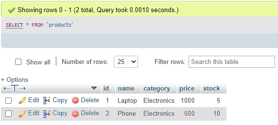

# ระบบจัดการสินค้า (Product Management System) Version 2 แบบเชื่อมต่อกับ Database MySQL

Task Week 3 : Back-End Dev for Dev Init

โดยใน ระบบจัดการสินค้า (Product Management System) Version 2 นี้ จะเป็นการปรับปรุงระบบหลังบ้านให้มีการเชื่อมต่อกับ Database MySQL ทำให้ข้อมูลในระบบของเราไม่หายไปเมื่อเซิร์ฟเวอร์ถูกปิดหรือรีสตาร์ทเหมือน Version แรก อีกทั้งยังทำให้การจัดการข้อมูลภายในระบบมีความยืดหยุ่นและปลอดภัยมากขึ้นด้วย

ซึ่งจากภาพข้างล่างนี้ คือ ตัวอย่างหน้าตาของ Database MySQL ที่ใช้เก็บข้อมูลของ ระบบจัดการสินค้า

